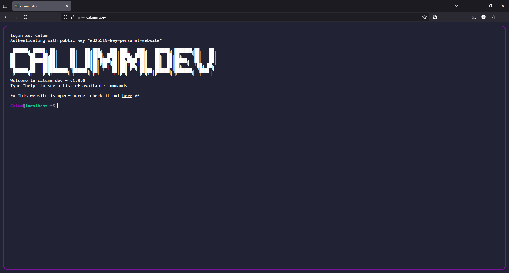

<h1 align="center">
   
  Personal Website
   
</h1>

<h4 align="center"></h4>

  <a href="#changelog">Changelog</a> •
  <a href="#usage">Usage</a> •
  <a href="#license">License</a> •
  <a href="#contributing">Contributing</a>

## Overview

A customisable terminal-style website, intended to act as a portfolio.

## Changelog

The full changelog can be found at [CHANGELOG.md](CHANGELOG.md)

## [3.0.0] - 2026-04-18

### Added

- `help` command - sort commands alphabetically
- (Docker) Support setting Nginx `real_ip_from`, see docs for environment variables 'REALIP_SOURCE',
  'REALIP_CUSTOM_FROM', 'REALIP_CUSTOM_HEADER'
- BREAKING: (Docker) Support host & bridge networking

### Changed

- (Docker) Utilise local logging driver

## [2.0.0] - 2026-04-16

### Added

- `date` command, see [config](./config.example.json)
- Command aliases, see [config](./config.example.json)
- (Docker) Add files to `./public/public/` to have them served at `/public/`. Does not require rebuild to reflect
  changes
- `pgp` command, see [config](./config.example.json)

### Fixed

- Tab completion no longer clears the current command

### Changed

- (Docker) BREAKING: Moved `compose.yml` to `compose.example.yml`
- (Docker) BREAKING: `NGINX_SERVER_NAME` environment variable is now respected. If unset, a 403 error will be returned
- (Docker) SSL certificates now use RSA 4096

## Usage

### Docker (Recommended)

1. Clone the repository
2. Copy `config.example.json` to `config.json` and configure as you desire. Fields beginning with `__comment` describe
   the related non-comment field.
3. Copy `compose.example.yml` to `compose.yml` and configure as you desire. Note - binds to `127.0.0.1` by default, to
   expose to the internet by default, bind to `0.0.0.0`. For environment variables, view [here](#environment-variables).
4. Copy any files you wish to be served alongside your website to `./public/public/`.
5. Run the container with Docker Compose `docker compose up -d --build`.
6. The container will now be bound to `127.0.0.1:443` using a self-signed certificate generated on first start-up.

  
Bring your own cert

If you wish to use your own certificate instead of using a self-signed, that is possible.

The startup script [`nginx/5-ssl.sh`](nginx/entrypoint.d/5-ssl.sh) checks for the presence of both inside the container at:

- `/etc/ssl/personal-website/personal-website.key`
- `/etc/ssl/personal-website/personal-website.crt`

Bind mount your cert and private key to these locations and Nginx will use your cert.

#### Environment Variables

| Name                      | Description                                                                                                                                                                                                 |
| ------------------------- | ----------------------------------------------------------------------------------------------------------------------------------------------------------------------------------------------------------- |
| `NGINX_SERVER_NAME`       | Used in the Nginx configuration template to respond to the correct server name, see [Nginx wiki](https://nginx.org/en/docs/http/server_names.html)                                                          |
| `REALIP_SOURCE`           | (`false`, `cloudflare`, `custom`) Extract the realip of a user from a request header                                                                                                                        |
| `REALIP_CUSTOM_FROM`      | Ignored if REALIP_SOURCE not 'custom'. Comma-seperated list of realip sources, see https://nginx.org/en/docs/http/ngx_http_realip_module.html#set_real_ip_from (e.g. `127.0.0.0/24,192.168.0.5,10.0.0.0/24` |
| `REALIP_CUSTOM_HEADER`    | Ignored if REALIP_SOURCE not 'custom'. See https://nginx.org/en/docs/http/ngx_http_realip_module.html#real_ip_header (e.g. `X-Real-IP`)                                                                     |
| `NGINX_HTTP_LISTEN_PORT`  | The port Nginx binds to for serving HTTP traffic (e.g. `80`)                                                                                                                                                |
| `NGINX_HTTPS_LISTEN_PORT` | The port Nginx binds to for serving HTTPS traffic (e.g. `443`)                                                                                                                                              |
| `NGINX_IPV4_LISTEN_ADDR`  | The IPV4 address Nginx binds to (e.g. `0.0.0.0`, `127.0.0.1`)                                                                                                                                               |
| `NGINX_IPV6_LISTEN_ADDR`  | The IPV4 address Nginx binds to (e.g. `[::]`, `[::1]`)                                                                                                                                                      |

### Build and deploy manually

1. Clone the repository
2. Copy `config.example.json` to `config.json` and configure as you desire. Fields beginning with `__comment` describe
   the related non-comment field.
3. Install dependencies, `npm install`
4. Deploy `dist/personal-website/browser` anywhere you wish.

## License

Licensed under either of

- Apache License, Version 2.0
  ([LICENSE-APACHE](LICENSE-APACHE) or http://www.apache.org/licenses/LICENSE-2.0)
- MIT license
  ([LICENSE-MIT](LICENSE-MIT) or http://opensource.org/licenses/MIT)

at your option.

## Contributing

Unless you explicitly state otherwise, any contribution intentionally submitted
for inclusion in the work by you, as defined in the Apache-2.0 license, shall be
dual licensed as above, without any additional terms or conditions.

See [CONTRIBUTING.md](CONTRIBUTING.md).

## Acknowledgement

Special thanks to [m4tt72](https://github.com/m4tt72/terminal) for inspiring the design.
